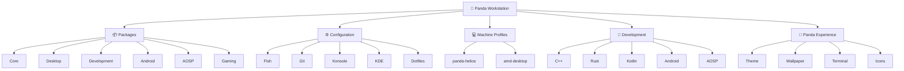

# 🐼 Panda Workstation

> **A clean, fast, reproducible CachyOS workstation for development, Linux learning, Android/AOSP, gaming, and future hardware migration.**

---

## 🧭 Status

| Layer | Status | Notes |
|---|:---:|---|
| 🐧 CachyOS | ✅ | Installed and operational |
| 🖥️ KDE Plasma | ✅ | Wayland primary |
| 🪟 Plasma X11 | ✅ | Fallback session available |
| 📦 Core CLI | ✅ | Installed from package manifest |
| 🗂️ Workspace layout | ✅ | Structured under `~/Workspace` |
| 🔐 GitHub authentication | ✅ | SSH / GitHub CLI |
| 🧰 Bootstrap | 🟡 | Core installer started |
| 🐚 Fish shell | 🟡 | Portable config pending |
| 🎨 KDE configuration | ⏳ | Pending |
| 🤖 Android / Kotlin | ⏳ | Pending |
| ⚙️ C++ | ⏳ | Pending |
| 🦀 Rust | ⏳ | Pending |
| 📱 AOSP | ⏳ | Pending |
| 🎮 Gaming | ⏳ | Pending |
| 🐼 Panda theme | ⏳ | Pending |
| 🔁 Full machine restore | ⏳ | Target milestone |

### Overall progress

```text
Base system       ████████████████████ 100%
Core tooling      ████████████████████ 100%
Portability       ███████░░░░░░░░░░░░░  35%
Development       ░░░░░░░░░░░░░░░░░░░░   0%
Gaming            ░░░░░░░░░░░░░░░░░░░░   0%
Panda experience  ░░░░░░░░░░░░░░░░░░░░   0%
```

---

# 🎯 Goals

| Goal | Description |
|---|---|
| ⚡ **Fast** | Keep the system lean and avoid unnecessary background services |
| 🧼 **Clean** | No random projects, downloads, SDKs, or scripts scattered around `$HOME` |
| 🔁 **Reproducible** | Rebuild most of the workstation from Git |
| 🧳 **Portable** | Move the environment to future hardware with minimal manual setup |
| 🧪 **Developer-first** | Linux, Android, Kotlin, C++, Rust, AOSP and general engineering |
| 🎮 **Game-ready** | Steam/Proton and gaming tools without compromising workstation quality |
| 🔐 **Secure** | Never commit credentials, private keys, API tokens, or signing material |
| 🐼 **Personal** | Consistent Panda visual identity across terminal, KDE and tooling |

---

# 🏗️ Workstation Architecture



---

# 💻 Machines

## 🐼 `panda-helios`

| Component | Configuration |
|---|---|
| Device | Acer Predator Helios 300 |
| CPU | Intel Core i7-7700HQ |
| GPU | Intel HD 630 + NVIDIA GTX 1060 |
| RAM | 32 GB DDR4 |
| System drive | Samsung 870 QVO 1 TB SATA SSD |
| OS | CachyOS |
| Desktop | KDE Plasma |
| Primary display protocol | Wayland |
| Fallback | Plasma X11 |

### Machine-specific notes

`panda-helios` contains configuration that **must not leak into generic workstation setup**, including:

- NVIDIA 580xx PRIME configuration
- Intel/NVIDIA hybrid graphics
- laptop-specific power behavior
- suspend/resume workarounds
- hardware-specific tuning

---

## 🖥️ `amd-desktop`

**Status:** `PLANNED`

```text
CPU      AMD
GPU      AMD
RAM      DDR5
Linux    CachyOS
Role     Primary future workstation
```

The goal is to migrate from:

```text
panda-helios
      │
      │ clone + bootstrap
      ▼
amd-desktop
```

without manually rebuilding the environment from memory.

---

# 🗂️ Filesystem Philosophy

```text
~
├── Workspace/
│   ├── projects/       # long-lived Git projects
│   ├── labs/           # learning and experiments
│   ├── aosp/           # Android Open Source Project
│   ├── tools/          # our scripts and utilities
│   ├── system/         # workstation configuration
│   └── scratch/        # intentionally disposable
│
├── Documents/
│   ├── Notes/
│   ├── Reference/
│   └── Templates/
│
└── Downloads/          # temporary inbox only
```

### 📏 Rules

| Location | Purpose |
|---|---|
| `~/Workspace/projects` | Real projects intended to survive |
| `~/Workspace/labs` | Learning, prototypes and experiments |
| `~/Workspace/aosp` | AOSP checkouts and builds |
| `~/Workspace/tools` | Scripts/utilities maintained by us |
| `~/Workspace/system` | Workstation configuration |
| `~/Workspace/scratch` | Disposable work |
| `~/Downloads` | Temporary files only |
| `~/Documents` | Human documents, not source repositories |

> 🚫 **No Git repositories in `Desktop`, `Downloads`, or random folders.**

---

# 📦 Package Layers

Packages are intentionally separated by responsibility.

| Manifest | Purpose | Status |
|---|---|:---:|
| `core.txt` | Essential CLI/system tools | ✅ |
| `desktop.txt` | Desktop and session utilities | ✅ |
| `development.txt` | Generic development tooling | ⏳ |
| `android.txt` | Android/Kotlin environment | ⏳ |
| `aosp.txt` | AOSP build dependencies | ⏳ |
| `gaming.txt` | Steam/Proton/gaming stack | ⏳ |
| `panda.txt` | Visual customization | ⏳ |

### Current core utilities

```text
tree          ripgrep       fd
fzf           bat           eza
jq            rsync         curl
wget          openssh       git
git-lfs       github-cli    btop
ncdu          fastfetch     unzip
7zip          unrar         lsof
strace        smartmontools nvme-cli
man-db        man-pages
```

---

# 🚀 Bootstrap

## Current

```text
bootstrap/
└── install-core.fish
```

Run:

```fish
./bootstrap/install-core.fish
```

The bootstrap uses:

```text
pacman -S --needed
```

so already-installed packages are not unnecessarily reinstalled.

---

## Target

Eventually:

```text
Fresh CachyOS
      │
      ▼
Clone panda-workstation
      │
      ▼
Run bootstrap
      │
      ├── 📦 Install packages
      ├── 🐚 Restore Fish
      ├── 🔧 Restore Git config
      ├── 🖥️ Restore Konsole
      ├── 🎨 Restore KDE
      ├── 🧰 Install development stacks
      ├── 🎮 Configure gaming
      └── 🐼 Apply Panda theme
      │
      ▼
Ready workstation
```

---

# 🔀 Git Conventions

## Branches

```text
main
```

is always expected to represent a usable workstation configuration.

Short-lived branches use:

```text
feat/android-toolchain
feat/panda-theme
feat/aosp-bootstrap

fix/nvidia-suspend
fix/bootstrap-packages

docs/setup-guide
chore/update-packages
```

---

## 💬 Conventional Commits

Format:

```text
type(scope): description
```

Examples:

```text
feat(bootstrap): add core package installer
feat(android): add Android development environment
feat(aosp): add build dependencies
feat(panda): add Plasma theme
fix(fish): correct manifest parsing
fix(helios): adjust NVIDIA suspend behavior
docs(readme): document workstation architecture
ci(validation): validate Fish scripts
chore(packages): refresh package manifests
```

### Types

| Type | Meaning |
|---|---|
| `feat` | New functionality |
| `fix` | Bug fix |
| `docs` | Documentation |
| `refactor` | Structural change |
| `test` | Tests or validation |
| `ci` | CI/CD |
| `chore` | Maintenance |

---

# 🔐 Security

## Never commit

```text
~/.ssh/
GitHub tokens
API keys
Android signing keys
passwords
private certificates
.env files with secrets
credentials
```

### Allowed

```text
SSH configuration templates
package lists
installation scripts
public Git configuration
KDE settings
Fish configuration
documentation
machine profiles
```

> 🔑 **The repository describes how credentials are configured.  
> It never contains the credentials themselves.**

---

# 🧪 Development Roadmap

### 🐚 Linux

- [x] CachyOS
- [x] Fish
- [x] Core CLI
- [ ] Shell functions
- [ ] Shell abbreviations
- [ ] Linux labs
- [ ] systemd labs
- [ ] networking labs
- [ ] kernel exploration

### ⚙️ C++

- [ ] GCC
- [ ] Clang
- [ ] CMake
- [ ] Ninja
- [ ] GDB
- [ ] LLDB
- [ ] sanitizers
- [ ] profiling

### 🦀 Rust

- [ ] rustup
- [ ] stable toolchain
- [ ] rustfmt
- [ ] clippy
- [ ] cargo tools
- [ ] Rust labs

### ☕ Kotlin / JVM

- [ ] JDK
- [ ] Kotlin
- [ ] Gradle
- [ ] JVM tooling

### 🤖 Android

- [ ] Android Studio
- [ ] Android SDK
- [ ] platform-tools
- [ ] emulator
- [ ] adb
- [ ] Gradle environment
- [ ] existing projects restored

### 📱 AOSP

- [ ] Build dependencies
- [ ] `repo`
- [ ] source checkout
- [ ] build environment
- [ ] first successful build
- [ ] AOSP exploration labs
- [ ] Binder / IPC experiments
- [ ] AAOS development environment

### 🎮 Gaming

- [ ] Steam
- [ ] Proton
- [ ] Proton-GE
- [ ] MangoHud
- [ ] GameMode
- [ ] controller support
- [ ] NVIDIA validation

---

# 🐼 Panda Experience

```text
PANDA WORKSTATION
━━━━━━━━━━━━━━━━━━━━━━━━━━━━━━━━━━━━

Theme       ⏳
Wallpaper   ⏳
Live mode   ⏳
Konsole     ⏳
Fastfetch   ⏳
Icons       ⏳
Lock screen ⏳

━━━━━━━━━━━━━━━━━━━━━━━━━━━━━━━━━━━━
```

Target aesthetic:

```text
⬛ Graphite
⬜ White
🐼 Panda
✨ Minimal
🧑‍💻 Developer-first
```

Two wallpaper modes are planned:

| Mode | Use |
|---|---|
| 🐼 **Panda Static** | Lowest resource usage |
| 🎞️ **Panda Live** | Animated wallpaper when performance allows |

Performance will be measured before enabling live wallpaper permanently.

---

# 🧭 Roadmap

```text
Phase 1 ━━━━━━━━━━━━━━━━━━━━ ✅ Base OS
Phase 2 ━━━━━━━━━━━━━━━━━━━━ ✅ Core CLI
Phase 3 ━━━━━━━░░░░░░░░░░░░░ 🟡 Portability
Phase 4 ░░░░░░░░░░░░░░░░░░░░ ⏳ Development
Phase 5 ░░░░░░░░░░░░░░░░░░░░ ⏳ AOSP
Phase 6 ░░░░░░░░░░░░░░░░░░░░ ⏳ Gaming
Phase 7 ░░░░░░░░░░░░░░░░░░░░ ⏳ Panda UI
Phase 8 ░░░░░░░░░░░░░░░░░░░░ ⏳ Full restore test
```

---

# ✅ Definition of Done

Panda Workstation reaches **v1.0** when a fresh supported CachyOS installation can be transformed into the intended workstation using documented, reproducible steps with minimal manual configuration.

```text
Fresh installation
        +
panda-workstation
        +
credentials
        =
🐼 Ready-to-use workstation
```

---

<details>
<summary>🔧 Design principles</summary>

### Portable first

Generic configuration belongs in shared workstation configuration.

### Machine-specific second

Hardware quirks belong under:

```text
machines/<hostname>/
```

### Declarative where possible

Prefer:

```text
package manifest
configuration file
bootstrap script
```

over undocumented manual setup.

### No mystery state

If a setting matters enough that losing it would be annoying, it should eventually be documented or reproducible.

### Keep it understandable

Automation should make the workstation easier to understand, not hide how Linux works.

</details>

---

## 🐼

**Build once. Understand it. Reproduce it.**
