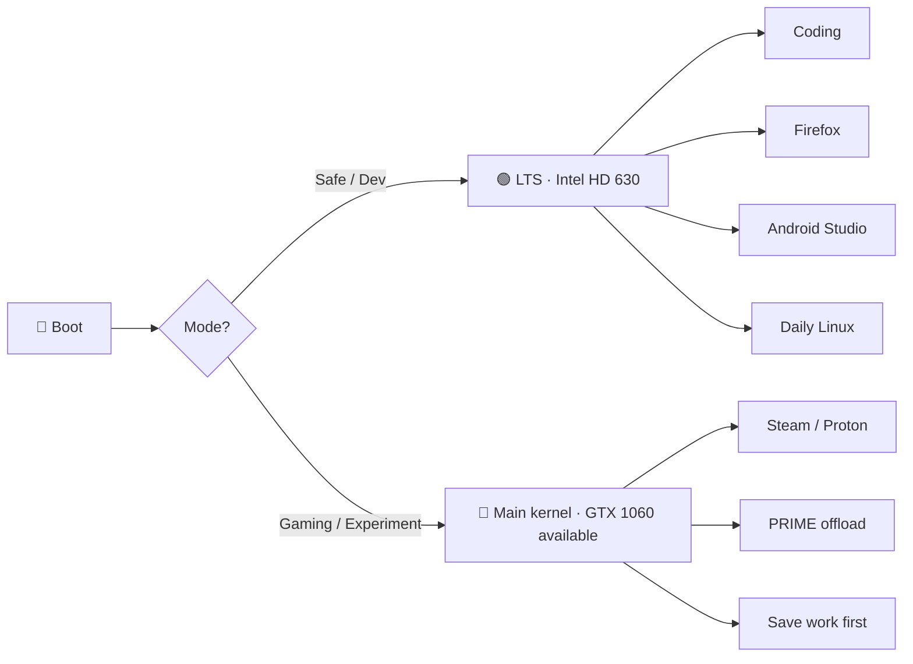
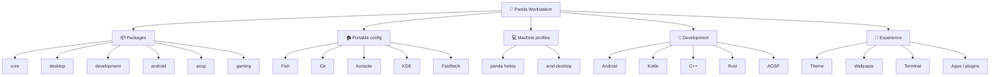
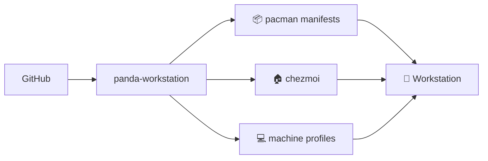

<div align="center">


# 🐼 Panda Workstation

### Reproducible CachyOS developer workstation

**⚡ Fast · 🧼 Clean · 🔁 Reproducible · 🧪 Developer-first · 🎮 Game-capable**

[](https://cachyos.org/)
[](https://kde.org/plasma-desktop/)
[](https://fishshell.com/)
[](https://www.chezmoi.io/)
[](https://github.com/adrianrusu16/panda-workstation/actions)

> **Build once. Understand it. Reproduce it.**

</div>

---

## 🚀 Restore path

The repository is organized so workstation state can move from “remembered setup” to reproducible setup.


| Need | Where to look |
|---|---|
| 📦 Package inventory | [`packages/`](packages/) |
| 🏠 Portable home config | [`home/`](home/) |
| 💻 Machine-specific behavior | [`machines/`](machines/) |
| 🚀 Bootstrap scripts | [`bootstrap/`](bootstrap/) |
| ✅ Repository checks | [`bootstrap/validate.fish`](bootstrap/validate.fish) |
| 🧭 Current implementation state | [Status](#-status) and [Roadmap](#-roadmap) |

> **Design rule:** portable defaults belong in shared configuration; hardware-specific exceptions belong in a machine profile.

---

## 🧭 Status

| Layer | Status | Notes |
|---|:---:|---|
| 🐧 CachyOS | ✅ | Installed on Samsung SATA SSD |
| 🖥️ KDE Plasma | ✅ | Wayland primary · X11 fallback |
| 📦 Core CLI | ✅ | Manifest-driven |
| 🔐 Git/GitHub | ✅ | Portable config + local identity split |
| 🐚 Fish | ✅ | CachyOS defaults + Panda layer |
| 🏠 chezmoi | ✅ | Portable home configuration |
| 💻 Machine profile | ✅ | Panda Helios LTS Intel-only policy verified |
| 🧪 Development foundation | ✅ | C/C++ · Rust · Node.js · Python · fish-lsp |
| 🧪 CI validation | ✅ | Fish + manifest checks |
| 🧰 Desktop package layer | ✅ | Base desktop utilities installed |
| 🎨 KDE / Konsole | ⏳ | Pending |
| 🤖 Android / Kotlin | ⏳ | Pending |
| ⚙️ C++ | ⏳ | Pending |
| 🦀 Rust | ⏳ | Pending |
| 📱 AOSP | ⏳ | Pending |
| 🎮 Gaming | ⏳ | Pending |
| 🐼 Panda theme | ⏳ | Pending |
| 🔁 Full restore test | ⏳ | v1.0 milestone |

```text
Base system       ████████████████████ 100%
Core tooling      ████████████████████ 100%
Portability       ████████████░░░░░░░░  60%
Development       ██░░░░░░░░░░░░░░░░░░  10%
Gaming            ░░░░░░░░░░░░░░░░░░░░   0%
Panda experience  ██░░░░░░░░░░░░░░░░░░  10%
```

---

## 🚨 Panda Helios stability lab

The current laptop is an aging **Acer Predator Helios 300** with a GTX 1060 that has shown repeated NVIDIA Xid faults and physical artifacting.

| Component / mode | State |
|---|:---:|
| Intel HD 630 | ✅ Primary stability target |
| GTX 1060 | ⚠️ Unstable · optional / experimental |
| `linux-cachyos-lts` | 🟢 Verified safe/dev · Intel-only |
| `linux-cachyos` | 🔴 Experimental / NVIDIA-capable |
| Suspend | 🚫 Disabled while stabilizing |
| Samsung 870 QVO | ✅ Current system drive |
| Intel 600p NVMe | ❌ Untrusted / retired from OS use |

### Intended dual-mode strategy



> The workstation must remain useful even if the discrete GPU is no longer reliable.

---

## 🎯 Design goals

| Goal | Meaning |
|---|---|
| ⚡ **Fast** | Minimal unnecessary background work |
| 🧼 **Clean** | Predictable filesystem and package organization |
| 🔁 **Reproducible** | Restore configuration from Git |
| 🧳 **Portable** | Move to future hardware with minimal manual setup |
| 🧪 **Developer-first** | Android, Kotlin, C++, Rust, AOSP and Linux |
| 🎮 **Game-capable** | Gaming layer is optional, not foundational |
| 🔐 **Secure** | Credentials never belong in the repository |
| 🐼 **Personal** | Consistent Panda identity across the workstation |

---

## 🏗️ Architecture



---

## 🗂️ Workspace

```text
~
├── Workspace/
│   ├── projects/       # long-lived Git projects
│   ├── labs/           # learning and experiments
│   ├── aosp/           # AOSP checkouts and builds
│   ├── tools/          # scripts and utilities
│   ├── system/         # workstation configuration
│   └── scratch/        # disposable work
│
├── Documents/
│   ├── Notes/
│   ├── Reference/
│   └── Templates/
│
└── Downloads/          # temporary inbox
```

---

## 📦 Package layers

| Manifest | Purpose | Status |
|---|---|:---:|
| `core.txt` | Essential CLI/system tooling | ✅ |
| `desktop.txt` | Desktop/session utilities | 🟡 |
| `development.txt` | Generic development tooling | ✅ |
| `android.txt` | Android/Kotlin stack | ⏳ |
| `aosp.txt` | AOSP build dependencies | ⏳ |
| `gaming.txt` | Steam/Proton/gaming stack | ⏳ |
| `panda.txt` | Visual customization | ⏳ |

---

## 🏠 Portable configuration

```text
panda-workstation/
├── bootstrap/
├── packages/
├── home/                    # chezmoi source root
│   ├── dot_config/
│   │   └── fish/
│   └── dot_gitconfig
├── machines/
│   ├── panda-helios/
│   └── amd-desktop/
└── .github/workflows/
```



---

## 🔀 Git conventions

**Default branch:** `main`

**Short-lived branches:**

```text
feat/android-toolchain
feat/panda-theme
feat/aosp-bootstrap
fix/nvidia-suspend
fix/bootstrap-packages
docs/setup-guide
chore/update-packages
```

**Conventional commits:**

```text
feat(bootstrap): add core package installer
feat(android): add Android development environment
fix(helios): isolate unstable NVIDIA GPU
docs(readme): document workstation architecture
ci(validation): validate Fish scripts
chore(packages): refresh package manifests
```

---

## 🔐 Security boundary

Never commit:

```text
~/.ssh/
tokens
API keys
Android signing keys
passwords
private certificates
.env secrets
credential files
```

Portable Git behavior is tracked; identity and credentials remain local.

---

## 🧪 Roadmap

```text
Phase 1 ━━━━━━━━━━━━━━━━━━━━ ✅ Base OS
Phase 2 ━━━━━━━━━━━━━━━━━━━━ ✅ Core CLI
Phase 3 ━━━━━━━━━██░░░░░░░░░ 🟡 Portability
Phase 4 ━━░░░░░░░░░░░░░░░░░░ 🟡 Development
Phase 5 ░░░░░░░░░░░░░░░░░░░░ ⏳ AOSP
Phase 6 ░░░░░░░░░░░░░░░░░░░░ ⏳ Gaming
Phase 7 ━━░░░░░░░░░░░░░░░░░░ ⏳ Panda UI
Phase 8 ░░░░░░░░░░░░░░░░░░░░ ⏳ Full restore
```

<details>
<summary><b>📋 Development targets</b></summary>

### 🐚 Linux
- [x] CachyOS
- [x] Fish
- [x] Core CLI
- [x] chezmoi
- [ ] systemd / networking labs
- [ ] kernel exploration

### ⚙️ C++
- [x] GCC / Clang
- [x] CMake / Ninja
- [x] GDB / LLDB
- [x] sanitizers / profiling

### 🦀 Rust
- [x] rustup
- [x] stable toolchain
- [x] rustfmt / clippy
- [ ] cargo tools

### 🤖 Android / Kotlin
- [ ] JDK
- [ ] Android Studio
- [ ] SDK / platform-tools / emulator
- [ ] Gradle environment

### 📱 AOSP
- [ ] build dependencies
- [ ] `repo`
- [ ] source checkout
- [ ] first build
- [ ] Binder / IPC labs
- [ ] AAOS exploration

### 🎮 Gaming
- [ ] Steam
- [ ] Proton
- [ ] Proton-GE
- [ ] MangoHud
- [ ] GameMode
- [ ] controller support
- [ ] NVIDIA-on-demand workflow

</details>

---

## 🐼 Panda experience

```text
Theme        ⏳
Wallpaper    ⏳
Live mode    ⏳
Konsole      ⏳
Fastfetch    ⏳
Icons        ⏳
Plugins      ⏳
App audit    ⏳
Gaming UI    ⏳
```

---

## ✅ Definition of done

**v1.0** means a fresh supported CachyOS installation can become the intended workstation through documented, reproducible steps with minimal manual configuration.

```text
Fresh CachyOS
      +
panda-workstation
      +
local credentials
      =
🐼 Ready-to-use workstation
```
