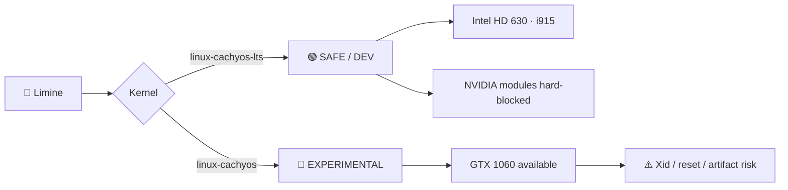

# 🐼 Panda Helios

## Verified machine policy

This profile describes the hardware-specific safety rules for the Acer Predator Helios 300 (`panda-helios`).

| Area | State | Policy |
|---|:---:|---|
| Intel HD 630 | ✅ | Primary graphics for normal development |
| GTX 1060 Mobile | ⚠️ | Unstable; experimental use only |
| `linux-cachyos-lts` | 🟢 | **Safe/dev mode · NVIDIA hard-blocked** |
| `linux-cachyos` | 🔴 | **Experimental mode · NVIDIA available** |
| Plasma Wayland | ✅ | Primary desktop session |
| Plasma X11 | ✅ | Fallback session |
| Suspend / hibernate | 🚫 | Masked while hardware stability is unresolved |
| Samsung 870 QVO | ✅ | System disk |
| Intel 600p NVMe | ❌ | Untrusted; do not use for the OS |

## GPU mode split



### Safe/dev kernel

The LTS entry must include:

```text
module_blacklist=nvidia,nvidia_drm,nvidia_modeset,nvidia_uvm,nouveau
```

Acceptance criteria for a valid safe boot:

```text
/proc/cmdline     contains the hard blacklist
lsmod             contains no nvidia* modules
lspci 01:00.0     has no NVIDIA driver in use
lspci 00:02.0     uses i915
current boot log  contains no NVRM Xid
```

Do not run `nvidia-smi` as part of safe-mode validation.

### Experimental kernel

The normal `linux-cachyos` entry intentionally does **not** inherit the NVIDIA hard blacklist.

Use it only when explicitly testing the discrete GPU or gaming stack. Save work first. The GTX 1060 has produced repeated Xid faults, GPU-reset-required states and physical display artifacts.

A global `blacklist nvidia` rule under `/etc/modprobe.d/*.conf` is not part of this design because it would also disable the experimental kernel.

## Suspend

Actual sleep states remain masked:

```text
sleep.target
suspend.target
hibernate.target
hybrid-sleep.target
```

This is intentional. Previous suspend/resume attempts produced NVIDIA Xid 158 and required GPU recovery.

## Storage

- Samsung 870 QVO 1 TB SATA: current trusted system disk.
- Intel 600p 256 GB NVMe: controller disappeared under installation workload and is considered untrusted.
- The NVMe should not contain mounted filesystems during normal operation.

## Validation

Run:

```fish
./machines/panda-helios/validate.fish
```

Or run the integrated stage:

```fish
./bootstrap/setup-machine.fish
```

The integrated stage is idempotent. It reconciles the LTS-specific Limine entry from the existing default/root command line, disables the obsolete Panda global NVIDIA blacklist if present, preserves the normal kernel as NVIDIA-capable, rebuilds Limine only when required, and then validates the actual runtime state.
